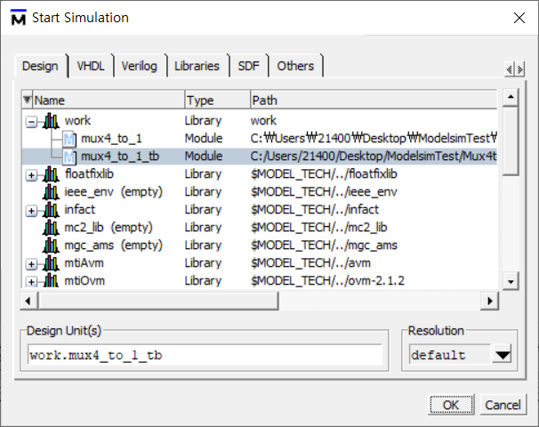

# Tutorial 1. 4-to-1 Mux 설계

## 프로젝트 생성 

ModelSim을 실행시킨 후, 'Jumpstart' → 'Create a Project'를 차례로 클릭합니다.


프로젝트 이름과 경로를 설정하여 줍니다. **이 때, 프로젝트 경로에 한글이 들어가면 프로젝트가 생성되지 않을 수 있습니다.** 가장 좋은 방법은 C:/ 경로에 새로운 폴더를 하나 추가한 후, 프로젝트 경로로 지정하여 주는 것입니다. 

## 4-to-1 Mux 설계 

Create New File을 클릭하여 새로운 소스 파일을 추가할 수 있습니다. 

mux4\_to\_1 이라는 이름이 파일을 하나 생성해주세요. 본 튜토리얼에서는 Verilog 언어 기반의 HDL 설계를 진행할 것이기 때문에, **Add file as type: Verilog** 로 설정하시면 됩니다.


아래의 소스 코드를 입력해주세요.

```text
module mux4_to_1 (out, i0, i1, i2, i3, s1, s0);

output reg out;
input i0, i1, i2, i3;
input s1, s0;

always @(s1 or s0 or i0 or i1 or i2 or i3) begin
  case({s1, s0})
    2'd0: out = i0;
    2'd1: out = i1;
    2'd2: out = i2;
    2'd3: out = i3;
    default: $display("invalid control signals");
  endcase
end

endmodule
```

코드 입력이 완료되시면, 좌측의 Project 패널을 우클릭 후, **'Compile all'** 버튼을 눌러줍시다. 문법적인 문제사항이 없다면 컴파일이 완료되었음을 알려주시는 체크표시가 나타날 것입니다.


## Testbench 작성 

위에서 완성한 module의 로직이 잘 작동하는지 확인하기 위해 testbench 파일을 추가해봅시다. testbench에서는 사용자가 module에 임의의 input을 주어서, 내가 의도한대로 output이 나오고 있는지 확인하게 됩니다. 

좌측 Project 패널을 우클릭한 후, Add to project → New File 을 클릭하여 mux4\_to\_1\_tb 라는 이름의 verilog 파일을 하나 생성해줍니다. 

이번에도 마찬가지로 파일 type을 Verilog로 설정하여 주시면 됩니다. 아래의 코드를 mux4\_to\_1\_tb에 입력해줍시다.

```text
`timescale 1ns/1ns

module mux4_to_1_tb();

wire out;
reg i0, i1, i2, i3;
reg s1, s0;

mux4_to_1 tb_mux(out, i0, i1, i2, i3, s1, s0);

initial begin
  {i0, i1, i2, i3} = 4'b0000;
  {s1, s0} = 2'b00;

#10;
  {i0, i1, i2, i3} = 4'b0101;
  {s1, s0} = 2'b00;

#10;
  {i0, i1, i2, i3} = 4'b0101;
  {s1, s0} = 2'b01;

#10;
  {i0, i1, i2, i3} = 4'b0101;
  {s1, s0} = 2'b10;

#10;
  {i0, i1, i2, i3} = 4'b0101;
  {s1, s0} = 2'b11;

#10;
  {i0, i1, i2, i3} = 4'b1001;
  {s1, s0} = 2'b00;

#10;
  {i0, i1, i2, i3} = 4'b1001;
  {s1, s0} = 2'b01;

#10;
  {i0, i1, i2, i3} = 4'b1001;
  {s1, s0} = 2'b10;

#10;
  {i0, i1, i2, i3} = 4'b1001;
  {s1, s0} = 2'b11;

end

endmodule
```


코드 입력이 끝나시면 Compile을 다시 한 번 진행하시고, 체크 표시가 보이는 것을 확인하시면 됩니다.


## Timing Diagram Simulation

Menu bar → Simulate → Start Simulation → 작성한 testbench 파일을 선택합니다.




확인하고 싶은 입출력 변수 선택 → 우클릭 → Add to wave 를 클릭합니다.


상단의 Run 버튼을 클릭하여 시뮬레이션을 진행할 수 있습니다. 또한 Zoom In, Zoom Out 버튼을 통해 시뮬레이션 확대 및 축소가 가능합니다.


여러 신호를 한 번에 보고 싶을 때는 묶고 싶은 신호를 선택 한 후, 우클릭 → Combine Signals 를 클릭하시면 됩니다.


신호 표시 방법 \(이진수, 십진수 등\)을 바꾸고 싶으실 때는, 신호 선택 → 우클릭 → Radix → 원하는 표시 방법을 선택해주시면 됩니다. 


